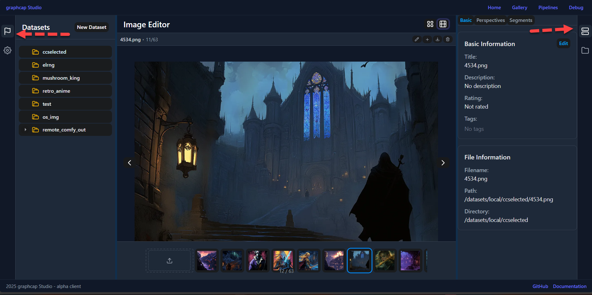

Action Drawers
=============

graphcap Studio now features collapsible action drawers on both sides of the interface for quick access to configuration and tools.

Left Action Drawer
----------------

The left drawer provides access to common configuration options and feature flags:

* Always present in the interface
* Contains feature toggles and standard configuration options
* Designed for frequent access to common settings
* Collapsible to maximize workspace when needed

Right Action Drawer
-----------------

The right drawer houses advanced options and developer tools:

* Optional visibility based on context
* Contains workspace file browser
* Server connection management
  * Media server status and configuration
  * graphcap server status and configuration
* Advanced configuration options

Usage
-----

Both drawers can be:

* Collapsed to icons-only mode to maximize workspace
* Expanded to full width for detailed configuration
* Toggled using the chevron controls when expanded

Key Benefits
----------

* Eliminates need for manual config file editing
* Provides 100% GUI-based configuration
* Centralizes all settings in easily accessible locations
* Separates common vs advanced options logically
* Maintains clean workspace while keeping tools accessible

