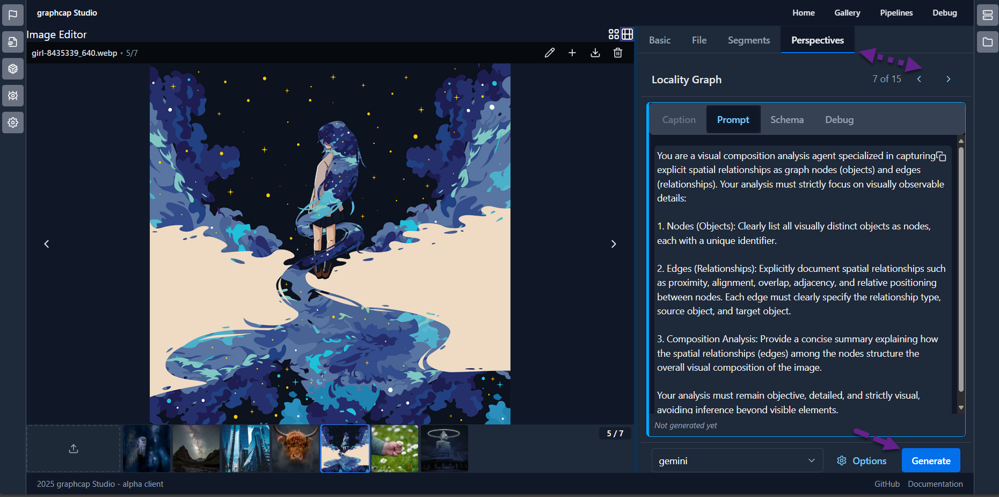

# GraphCap Perspective Library

## Overview

The Perspective Library is a collection of specialized analytical frameworks for image understanding and captioning. Each perspective provides a unique lens through which to analyze and describe visual content, from objective factual descriptions to creative interpretations, temporal analyses, and specialized domain-specific insights.

Think of a perspective as a unique way of looking at and describing an image - just as a photographer, art critic, and child might describe the same photograph differently. The Perspective Library organizes these different viewpoints into a structured, modular system that can be used individually or in combination to generate rich, multi-faceted image descriptions.

For a comprehensive conceptual overview of perspectives, see the [Perspectives Concept Documentation](../../doc/concepts/perspectives.rst).

## Library Structure

The Perspective Library is organized into modules, each containing perspectives with related focuses:

- **[Core](./core/)**: Fundamental perspectives forming the backbone of the image analysis pipeline, providing objective, structured analysis from complementary angles. These represent our "gold standard" for image captioning.

- **[Creative](./creative/)**: Perspectives designed to generate "controlled hallucinations" - creative extensions beyond what's directly visible in the image while remaining plausibly connected to the visual content.

- **[Video](./video/)**: Specialized perspectives for transforming static images into rich, dynamic prompts for video generation, focusing on motion potential, narrative progression, and cinematic elements.

- **[Niche](./niche/)**: Focused analytical perspectives targeting specific dimensions of visual content, extracting specialized information optimized for particular use cases or domains.

Each module contains a README with detailed information about its specific perspectives and their applications.

## Using Perspectives

Perspectives can be used in several ways:

### 1. Through the GraphCap UI

The easiest way to use perspectives is through the GraphCap web interface:

1. Select an image from your dataset
2. Choose a perspective from the right hand panel
3. Generate the analysis
4. View the structured output with all fields



## Creating New Perspectives

To create a new perspective:

1. **Determine the Module**: Decide which module your perspective belongs to (core, creative, video, niche), or create a new module if needed.

2. **Create the JSON File**: Create a new JSON file in the appropriate module directory with the following structure:

```json
{
  "name": "my_perspective",
  "display_name": "My Perspective",
  "version": "1",
  "prompt": "Your detailed prompt for the perspective...",
  "schema_fields": [
    {
      "name": "field_name",
      "type": "str",
      "description": "Description of this field.",
      "is_list": false
    },
    // Additional fields...
  ],
  "table_columns": [
    {
      "name": "Column Name",
      "style": "cyan"
    },
    {
      "name": "Value",
      "style": "green"
    }
  ],
  "context_template": "<MyPerspective>\n{field_name}\n</MyPerspective>\n",
  "module": "your_module",
  "type": "perspective",
  "tags": ["relevant", "tags", "here"],
  "description": "A concise description of your perspective.",
  "deprecated": false,
  "priority": 50
}
```

3. **Structure Your Prompt**: Craft a clear, detailed prompt that guides the AI to produce structured output in the desired format. Make sure it:
   - Clearly defines the analytical focus
   - Specifies what elements to look for
   - Provides a structured format for responses
   - Maintains objectivity or clearly specifies where interpretation is allowed

4. **Define Schema Fields**: Create fields that capture the structured output of your perspective. Each field should have:
   - A clear name
   - Type (str, int, float, dict)
   - Description
   - Whether it's a list or a single value
   - For complex fields, nested field definitions

5. **Test Your Perspective**: Before committing, test your perspective with a variety of images to ensure it consistently produces high-quality, useful output.

6. **Document Your Perspective**: Update the module's README.md to include your new perspective, its purpose, and use cases.

For more detailed guidance on creating effective perspectives, refer to the [Perspectives Concept Documentation](../../doc/concepts/perspectives.rst).

## Integration with Other Systems

Perspectives can be integrated with:

- **Training Data Generation**: Use perspectives to create rich, structured annotations for ML training
- **Content Management Systems**: Enhance image metadata with perspective analyses
- **Creative Tools**: Generate prompts and inspiration from perspective outputs
- **Search Systems**: Enable sophisticated image retrieval based on perspective-generated attributes

## Best Practices

- **Combine Complementary Perspectives**: Pair factual perspectives with interpretative ones for comprehensive analysis
- **Match Perspectives to Use Cases**: Select perspectives based on your specific needs
- **Version Control**: When updating perspectives, increment the version number and document changes
- **Validate Outputs**: Periodically review perspective outputs to ensure quality and accuracy

## Contributing

Contributions to the Perspective Library are welcome! To contribute:

1. Fork the repository
2. Create your perspective following the guidelines above
3. Add appropriate documentation
4. Submit a pull request with a clear description of your new perspective

For more information on contributing, see the [Contributing Guide](../../CONTRIBUTING.md).

